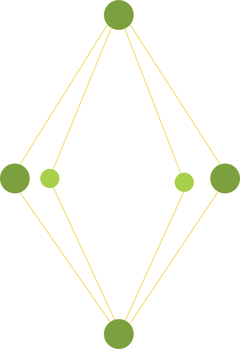

    

<h1 align="center">structe</h1>

  Front End Architecture Tool

 

## Team

- :norway: [Even Stensberg](https://twitter.com/evenstensberg), [webpack](https://webpack.js.org/) / [Studix](https://studix.com/)
- :libya: [Ayoub Alfurjani](https://twitter.com/ZeroDrive1), [Muljin](https://muljin.com/) / [Joopie](https://joopie.co/)
- :norway: [Aron Nicholasson](https://twitter.com/ANicholasson), [twoday](https://twoday.com/)
